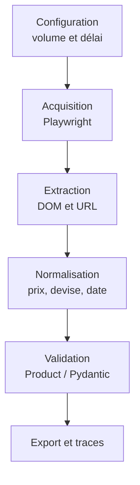

# Compte rendu — Projet individuel de web scraping 

## Informations de remise

| Champ                                    | Réponse                                                                            |
| ---------------------------------------- | ----------------------------------------------------------------------------------- |
| Nom et prénom                           | **A. DEMURE**                                                                 |
| Groupe                                   | Travail individuel                                                                  |
| Identifiant de cible                     | S16                                                                                 |
| Nom du site                              | Sauce Demo                                                                          |
| URL de départ                           | https://www.saucedemo.com/                                                          |
| Cible basculée en cours de TP ?         | Non                                                                                 |
| Dépôt GitHub public                    | [github.com/lilipix/saucedemo-scraper](https://github.com/lilipix/saucedemo-scraper) |
| Hash complet du commit évalué          | **[À COMPLÉTER après le dernier commit]**                                  |
| Date et heure d’envoi                   | **[À COMPLÉTER]**                                                           |
| Commande de lancement limité            | **make all**                                                                  |
| Commande de vérification                | **[À relever dans le README ou le Makefile]**                                |
| Lien GitHub testé en navigation privée | **[x]**                                                                       |

## 1. Résumé exécutif

Le projet Python collecte les six produits constituant l’inventaire complet du site de démonstration Sauce Demo. Il ouvre une session avec les identifiants affichés par le site, puis réutilise l’état authentifié afin d’éviter une nouvelle connexion pour chaque page. La collecte couvre l’inventaire, les six pages de détail et les quatre ordres de tri demandés dans la fiche cible. Les données sont normalisées et validées dans un modèle `Product`, puis écrites dans un fichier JSONL à chaque exécution. La principale difficulté est que les produits ne sont accessibles qu’après l’exécution du JavaScript et l’authentification ; Playwright a donc été retenu pour piloter un navigateur. Le volume maximal et le délai entre les actions de navigation sont configurables afin de limiter la charge et de rendre la collecte reproductible.

> **À vérifier dans le dépôt :** les quatre tris et la réutilisation de session doivent être effectivement présents dans la version remise. Si une fonctionnalité n’est pas terminée, la retirer de ce résumé.

## 2. Diagnostic de la cible

### 2.1 Périmètre et règles d’accès

Le périmètre est limité à Sauce Demo : page de connexion, inventaire complet de six produits, quatre ordres de tri et six pages de détail. Les identifiants utilisés sont les identifiants de démonstration affichés publiquement sur la page de connexion ; aucun mécanisme de protection n’est contourné. Le volume de produits est plafonné par `MAX_PRODUCTS` et le délai entre deux actions de navigation est configurable. La concurrence maximale retenue est de 1 : les navigations sont exécutées successivement dans un seul flux Playwright.

Le fichier `robots.txt`, l’absence de conditions générales d’utilisation et l’absence de politique de confidentialité ont été examinés dans la fiche cible. **[RECOPIER ICI la règle exacte observée dans `robots.txt`, son URL, la date de consultation et la conclusion applicable aux chemins collectés.]** Aucun `Crawl-delay` n’a été observé **[À CONFIRMER]**. Le délai choisi est de **[VALEUR RÉELLE] ms** entre deux actions de navigation.

### 2.2 HTML, SPA, API ou combinaison

| Élément                         | Observation / preuve                                                                                                                                                                      |
| --------------------------------- | ----------------------------------------------------------------------------------------------------------------------------------------------------------------------------------------- |
| HTML initial                      | Un simple`GET` ne fournit pas l’inventaire exploitable tel qu’il apparaît après connexion. **[Ajouter le nombre de caractères et l’absence d’un nom de produit précis.]** |
| DOM après rendu                  | Après exécution du JavaScript et authentification, le DOM contient les six cartes produit.**[Ajouter le compteur réellement observé.]**                                         |
| Requête(s) réseau utile(s)      | Aucune API publique stable n’a été retenue pour l’acquisition ; les données sont lues dans le DOM rendu.**[Confirmer avec l’onglet Réseau.]**                                |
| Pagination, défilement ou filtre | Aucune pagination : l’inventaire complet contient six produits sur une page. Quatre tris sont disponibles dans la liste déroulante.                                                     |
| Décision d’acquisition          | Playwright, car la navigation, l’authentification et l’exécution du JavaScript sont nécessaires.                                                                                      |

Le diagnostic confirme l’indication de la fiche cible : le contenu produit est absent du HTML initial exploitable et devient disponible dans le DOM après exécution du JavaScript et connexion. **[Ne cocher “conforme” qu’après avoir ajouté la preuve chiffrée.]**

## 3. Objet et modèle de données

Objet principal : `Product`.

| Champ            | Type                              | Obligatoire ? | Source                                      | Normalisation / règle d’absence                                       |
| ---------------- | --------------------------------- | ------------: | ------------------------------------------- | ----------------------------------------------------------------------- |
| `id`           | entier ≥ 0                       |           Oui | paramètre`id` de l’URL de détail       | Conversion en entier ; rejet si absent ou invalide                      |
| `name`         | chaîne non vide                  |           Oui | titre du produit                            | Suppression des espaces périphériques ; rejet si vide                 |
| `price`        | `Decimal` positif, 2 décimales |           Oui | prix affiché                               | Retrait du symbole monétaire puis conversion en`Decimal`             |
| `currency`     | chaîne                           |           Oui | symbole du prix                             | `$` converti en code devise **[confirmer la valeur : `USD`]** |
| `description`  | chaîne non vide                  |           Oui | page de détail                             | Nettoyage des espaces ; rejet si vide                                   |
| `url`          | URL HTTP valide                   |           Oui | URL de la page de détail                   | Validation par`HttpUrl`                                               |
| `sort_order`   | entier de 1 à`MAX_PRODUCTS`    |           Oui | position du produit dans l’ordre collecté | Validation de l’intervalle                                             |
| `collected_at` | date et heure                     |           Oui | généré lors de la collecte               | Sérialisation ISO 8601                                                 |

L’identifiant stable est extrait du paramètre `id` de l’URL `inventory-item.html?id=…`. La déduplication doit utiliser cet identifiant : deux observations ayant le même `id` représentent le même produit, même si les tris modifient sa position. Une valeur absente provoque un échec d’extraction ou de validation ; une chaîne présente mais vide est également refusée pour les champs obligatoires. Le modèle Pydantic est configuré avec `extra="forbid"` afin de détecter les champs inattendus.

## 4. Architecture et flux



| Composant                                                  | Responsabilité                                     | Entrée                        | Sortie                                |
| ---------------------------------------------------------- | --------------------------------------------------- | ------------------------------ | ------------------------------------- |
| `config.py`                                              | Centraliser chemins, plafond et délai              | Variables de configuration     | Constantes utilisées par les scripts |
| Script de connexion**[nom à confirmer]**                  | Ouvrir la session et conserver l’état connecté   | Identifiants de démonstration | Contexte ou état authentifié        |
| Script d’inventaire**[nom à confirmer]**                 | Collecter les liens et les ordres de tri            | Page inventaire                | Références de produits              |
| `scrape_details.py`                                      | Visiter les pages de détail et extraire les champs | URLs produit                   | Données brutes                       |
| Fichier du modèle`Product` **[nom à confirmer]** | Normaliser et valider                               | Dictionnaire brut              | Objet`Product` valide ou erreur     |
| Export / vérification**[nom à confirmer]**               | Écrire le résultat et contrôler sa cohérence    | Produits validés              | Fichier final et compteurs            |

## 5. Ancrage des sélecteurs

| Champ | Ancrage retenu                                                              | Pourquoi plus stable que…                                                                                              | Si l’ancrage disparaît                                                                  |
| ----- | --------------------------------------------------------------------------- | ----------------------------------------------------------------------------------------------------------------------- | ----------------------------------------------------------------------------------------- |
| Nom   | Attribut`data-test` du titre produit **[valeur exacte à relever]** | Il décrit le rôle de l’élément dans les tests du site ; une classe CSS peut changer pour une modification visuelle | L’extraction doit échouer explicitement ou la validation Pydantic rejette le nom absent |
| Prix  | Attribut`data-test` du prix **[valeur exacte à relever]**          | Il cible directement la donnée, contrairement à un chemin DOM fondé sur la position                                  | L’objet est rejeté car`price` est obligatoire et strictement positif                  |

Les attributs `data-test` ne constituent pas un contrat public : ils sont seulement jugés moins fragiles que les classes de présentation observées sur cette page.

## 6. Choix des outils

| Besoin                | Outil retenu                                           | Pourquoi                                                                                          | Alternative envisagée | Pourquoi écartée                                                                    |
| --------------------- | ------------------------------------------------------ | ------------------------------------------------------------------------------------------------- | ---------------------- | ------------------------------------------------------------------------------------- |
| Acquisition           | Playwright Python, API**[synchrone à confirmer]**     | Exécute JavaScript, remplit le formulaire et conserve la session                                 | `httpx`              | Un simple client HTTP ne reproduit pas directement le parcours navigateur nécessaire |
| Extraction            | Locators Playwright                                    | Interroge le DOM rendu et permet d’attendre les éléments                                       | BeautifulSoup seule    | Ne rend pas JavaScript et ne gère pas la connexion interactive                       |
| Modèle et validation | Pydantic                                               | Types, contraintes et rejet des champs supplémentaires                                           | Dictionnaires Python   | Ne garantissent pas seuls la structure finale                                         |
| Vérification         | **[pytest ou script de contrôle à confirmer]** | Contrôles reproductibles                                                                         | Vérification manuelle | Moins reproductible et insuffisante pour les cas d’erreur                            |
| Export                | JSONL                                                  | Format imposé ; un objet JSON autonome par ligne, facile à relire et à traiter progressivement | JSON classique ou CSV  | Non conformes au format de rendu demandé                                             |

**Décision 1 — navigateur plutôt que client HTTP seul.** Le coût est un lancement plus lourd et une dépendance à Chromium, mais Playwright correspond au besoin observé : connexion, JavaScript et session. Employer `httpx` uniquement parce qu’il est asynchrone n’aurait pas résolu ce besoin.

**Décision 2 — parcours séquentiel et délai configurable.** Une concurrence maximale de 1 allonge légèrement l’exécution, mais elle suffit pour six produits, simplifie la réutilisation de session et limite la charge envoyée au site de démonstration.

## 7. Résultats et vérification

> Les valeurs suivantes doivent provenir d’une exécution finale, pas d’une estimation.

| Indicateur                     |                                                Valeur |
| ------------------------------ | ----------------------------------------------------: |
| Pages ou requêtes traitées   |                                **[À MESURER]** |
| Objets vus                     | **[À MESURER ; attendu : 6 produits uniques]** |
| Objets exportés dans le JSONL |                                **[À MESURER]** |
| Objets rejetés                |                                **[À MESURER]** |
| Doublons détectés            |                                **[À MESURER]** |
| Champs obligatoires manquants  |                                **[À MESURER]** |
| Durée de la collecte limitée |                                **[À MESURER]** |
| Délai appliqué               |                     **[VALEUR CONFIGURÉE] ms** |

Forme de vérification : **[cocher trois tests automatisés ou un script de contrôle exécutable]**.

| # | Contrôle                                                                                                        | Résultat                |
| -: | ---------------------------------------------------------------------------------------------------------------- | ------------------------ |
| 1 | Une page enregistrée produit le nombre attendu d’objets                                                        | **[À EXÉCUTER]** |
| 2 | `"$29.99"` est normalisé en montant décimal `29.99` et devise `USD` **[à adapter au code réel]** | **[À EXÉCUTER]** |
| 3 | Deux observations ayant le même`id` sont dédupliquées, ou un produit incomplet est rejeté                  | **[À EXÉCUTER]** |

Cas d’erreur géré : **[choisir un cas réellement présent dans le code et réellement testé : sélecteur absent, échec de connexion, produit invalide ou erreur réseau]**. Décrire précisément l’action du programme : arrêt explicite, rejet de l’objet, trace produite et éventuel code de sortie.

## 8. Reproductibilité

Depuis un clone neuf, l’utilisateur doit installer la version de Python indiquée dans le projet, créer l’environnement virtuel, installer les dépendances puis installer le navigateur Playwright. Le `Makefile` ajouté au dépôt doit fournir les commandes principales **[recopier les cibles exactes]**. À chaque lancement, le résultat doit être écrit dans le fichier JSONL documenté dans le README. Les éventuels paramètres de volume et de délai doivent être documentés avec leurs valeurs par défaut. Les identifiants employés sont ceux de démonstration affichés par Sauce Demo ; aucun secret ne doit être versionné. La procédure exacte doit être rejouée dans un second dossier avant la remise.

Exemple à adapter au dépôt réel :

```bash
make install
playwright install chromium
make run
make check
```

## 9. Limites et amélioration prioritaire

1. Le collecteur dépend des attributs `data-test`, du parcours de connexion et de la structure actuelle du DOM. Leur modification peut interrompre l’extraction.
2. La collecte dépend du réseau et de la disponibilité de Sauce Demo ; les contrôles ne doivent donc pas dépendre uniquement d’une exécution en ligne.
3. La cible est volontairement limitée à six produits et à une seule devise. Le comportement sur un grand catalogue, une pagination ou plusieurs devises n’est pas démontré.

Avec une demi-journée supplémentaire, la priorité serait d’ajouter ou de consolider trois contrôles hors réseau à partir de pages enregistrées. Ils permettraient de vérifier l’extraction, la normalisation du prix et le rejet ou la déduplication même si le site est indisponible ou modifié le jour de l’évaluation.

## 10. Usage de l’IA

| Élément                         | Réponse                                                                                                                                                              |
| --------------------------------- | --------------------------------------------------------------------------------------------------------------------------------------------------------------------- |
| Outils IA utilisés               | ChatGPT                                                                                                                                                               |
| Tâches confiées                 | Explication des notions du cours, relecture de code, aide au diagnostic, proposition de structure et rédaction du compte rendu                                       |
| Vérifications réalisées        | Exécution locale du code, comparaison avec les sorties obtenues, contrôle des champs et correction des propositions ne correspondant pas au dépôt                 |
| Proposition corrigée ou refusée | **[Indiquer un exemple réel, par exemple une proposition trop complexe ou une fonctionnalité absente du code.]**                                              |
| Pourquoi                          | Le dépôt et les résultats d’exécution constituent la source de vérité ; une proposition d’IA ne doit pas être déclarée comme réalisée sans vérification |

Deux demandes significatives à déclarer :

1. Aide à rendre le volume maximal et le délai entre navigations configurables.
2. Relecture de l’architecture Playwright et explication du choix entre API synchrone et asynchrone.

## 11. Préparation de l’oral

**Message essentiel :** j’ai choisi Playwright à partir du diagnostic de la cible, puis j’ai limité et validé la collecte afin d’obtenir six produits propres sans me reconnecter à chaque page.

**Extrait de code à expliquer :** le fichier contenant la réutilisation de session ou le modèle `Product` et ses validateurs, **[ajouter fichier et lignes après le dernier commit]**.

**Panne à diagnostiquer :** un locator ne trouve plus le prix d’un produit. Vérifier successivement la connexion, l’URL, le DOM rendu, l’attente, la valeur de `data-test`, puis le comportement de validation.

**Plan de secours si la démonstration échoue :** montrer un export final daté, les traces et compteurs d’une exécution réussie, puis exécuter les contrôles hors réseau sur les pages enregistrées.

## Déclaration

Je déclare :

- que ce travail et ce dépôt correspondent à ma production individuelle ;
- que les sources et les usages significatifs de l’IA sont déclarés ;
- que je peux expliquer et modifier le code remis ;
- que je n’ai contourné aucun mécanisme de protection ni aucune interdiction du `robots.txt` ;
- que le dépôt ne contient ni secret ni donnée personnelle.

Nom : **[À COMPLÉTER]**
Date : **[À COMPLÉTER]**

---

## Périmètre conseillé pour la remise

Les livrables explicitement demandés sont :

1. un dépôt Git public et accessible ;
2. un projet Python fonctionnel ;
3. un résultat écrit en JSONL à l’exécution ;
4. un README présentant les spécificités techniques et précisant qu’il s’agit d’un travail individuel ;
5. une fiche descriptive par site cible, selon le modèle du module 1 ;
6. éventuellement une démonstration ou une présentation.

Il n’est donc pas nécessaire d’ajouter une architecture industrielle artificielle. Pour remplir honnêtement la trame :

- conserver les rubriques de diagnostic, modèle, sélecteurs, outils, résultats et reproductibilité ;
- décrire l’architecture réellement présente, même si elle tient dans quelques fichiers ;
- ne pas ajouter de base de données, de parallélisme, de reprise automatique complexe ou d’observabilité si ces éléments ne sont ni demandés ni déjà présents ;
- écrire « non traité » lorsqu’une capacité n’existe pas ;
- fournir surtout des preuves courtes : sorties, compteurs, commandes et renvois vers le code.

### Vérification minimale avant remise

- [ ] Le dépôt est public et s’ouvre en navigation privée.
- [ ] Le README indique clairement qu’il s’agit d’un travail individuel.
- [ ] Les commandes d’installation et de lancement fonctionnent depuis un clone neuf.
- [ ] Une exécution recrée bien le fichier JSONL attendu.
- [ ] Chaque ligne du fichier est un objet JSON valide.
- [ ] Le fichier contient le nombre d’objets annoncé dans le compte rendu.
- [ ] La fiche cible Sauce Demo est présente dans le dépôt.
- [ ] Aucun mot de passe personnel, jeton ou secret n’est versionné.
- [ ] Une sortie et des traces d’exécution sont disponibles en secours pour une éventuelle démonstration.
