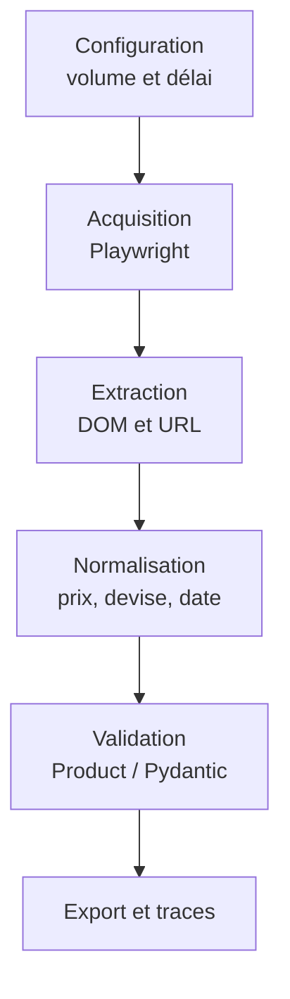

# Compte rendu — Projet individuel de web scraping

## Informations de remise

| Champ                                    | Réponse                                                                            |
| ---------------------------------------- | ----------------------------------------------------------------------------------- |
| Nom et prénom                           | **A. DEMURE**                                                                 |
| Groupe                                   | Travail individuel                                                                  |
| Identifiant de cible                     | S16                                                                                 |
| Nom du site                              | Sauce Demo                                                                          |
| URL de départ                           | https://www.saucedemo.com/                                                          |
| Cible basculée en cours de TP ?         | Non                                                                                 |
| Dépôt GitHub public                    | [github.com/lilipix/saucedemo-scraper](https://github.com/lilipix/saucedemo-scraper) |
| Hash complet du commit évalué          | **[À COMPLÉTER après le dernier commit]**                                  |
| Date et heure d’envoi                   | **[À COMPLÉTER]**                                                           |
| Commande de lancement limité            | **make all**                                                                  |
| Commande de vérification                | **make validate**                                                             |
| Lien GitHub testé en navigation privée | **[x]**                                                                       |

## 1. Résumé exécutif

Ce projet collecte les six produits constituant l’inventaire complet du site de démonstration Sauce Demo. Il ouvre une session avec les identifiants affichés par le site, puis réutilise l’état authentifié afin d’éviter une nouvelle connexion pour chaque page. La collecte couvre l’inventaire, les six pages de détail et les quatre ordres de tri demandés. Les données sont normalisées par le script de transformation, contrôlées par le script de validation, puis écrites dans un fichier JSONL à chaque exécution. La principale difficulté est que les produits ne sont accessibles qu’après l’exécution du JavaScript et l’authentification ; Playwright a donc été retenu pour piloter un navigateur. Le volume maximal et le délai entre les actions de navigation sont centralisés dans `config.py` afin de limiter la charge et de rendre la collecte reproductible.

## 2. Diagnostic de la cible

### 2.1 Périmètre et règles d’accès

Le périmètre est limité à Sauce Demo : page de connexion, inventaire complet de six produits, quatre ordres de tri et six pages de détail. Les identifiants utilisés sont les identifiants de démonstration affichés publiquement sur la page de connexion ; aucun mécanisme de protection n’est contourné. Le volume de produits est plafonné par `MAX_PRODUCTS` et le délai entre deux actions de navigation est configurable. La concurrence maximale retenue est de 1 : les navigations sont exécutées successivement dans un seul flux Playwright.

Le fichier `robots.txt` a été consulté à l’adresse `https://www.saucedemo.com/robots.txt` le 30/07/2026 lors de la fiche cible. La règle observée est `User-agent: *` avec `Disallow:` vide : les chemins collectés ne sont donc pas interdits par ce fichier. Aucun `Crawl-delay` n’a été observé. En l’absence de délai publié, le projet applique une concurrence maximale de 1 et un délai de 500 ms entre deux actions de navigation. Aucune condition générale d’utilisation ni politique de confidentialité propre à Sauce Demo n’a été trouvée lors du diagnostic ; la collecte reste limitée aux six produits de démonstration et ne porte sur aucune donnée personnelle.

### 2.2 HTML, SPA, API ou combinaison

| Élément                         | Observation / preuve                                                                                                                                                                                                                     |
| --------------------------------- | ---------------------------------------------------------------------------------------------------------------------------------------------------------------------------------------------------------------------------------------- |
| HTML initial                      | Un simple`GET` sur `https://www.saucedemo.com/` renvoie un HTML de 1349 caractères avec un conteneur `<div id="root"></div>`. Le nom `Sauce Labs Backpack` y apparaît 0 fois.                                                  |
| DOM après rendu                  | Après exécution du JavaScript et authentification, le DOM contient les six cartes produit attendues :`check_session.py` affiche `Produits visibles : 6`.                                                                           |
| Requête(s) réseau utile(s)      | Aucune API publique stable n’a été retenue pour l’acquisition ; d’après le diagnostic réseau de la fiche cible, aucun appel Fetch/XHR exploitable ne fournit les données produit. Les données sont donc lues dans le DOM rendu. |
| Pagination, défilement ou filtre | Aucune pagination : l’inventaire complet contient six produits sur une page. Quatre tris sont disponibles dans la liste déroulante.                                                                                                    |
| Décision d’acquisition          | Playwright, car la navigation, l’authentification et l’exécution du JavaScript sont nécessaires.                                                                                                                                     |

Le diagnostic confirme l’indication de la fiche cible : le contenu produit est absent du HTML initial exploitable et devient disponible dans le DOM après exécution du JavaScript et connexion.

## 3. Objet et modèle de données

Objet principal : `Product`.

| Champ            | Type                              | Obligatoire ? | Source                                      | Normalisation / règle d’absence                                       |
| ---------------- | --------------------------------- | ------------: | ------------------------------------------- | ----------------------------------------------------------------------- |
| `id`           | entier ≥ 0                       |           Oui | paramètre`id` de l’URL de détail       | Extrait pendant la transformation ; rejet si absent ou invalide          |
| `name`         | chaîne non vide                  |           Oui | titre du produit                            | Suppression des espaces périphériques ; rejet si vide                 |
| `price`        | `Decimal` positif, 2 décimales |           Oui | prix affiché                               | Retrait du symbole monétaire puis conversion en`Decimal`             |
| `currency`     | chaîne                           |           Oui | symbole du prix                             | `$` converti en code devise `USD` |
| `description`  | chaîne non vide                  |           Oui | page de détail                             | Nettoyage des espaces ; rejet si vide                                   |
| `url`          | URL HTTP valide                   |           Oui | URL de la page de détail                   | Validation par`HttpUrl`                                               |
| `sort_order`   | entier de 1 à`MAX_PRODUCTS`    |           Oui | position du produit dans l’ordre collecté | Validation de l’intervalle                                             |
| `collected_at` | date et heure                     |           Oui | généré lors de la transformation         | Sérialisation ISO 8601                                                 |

L’identifiant stable est extrait du paramètre `id` de l’URL `inventory-item.html?id=…`. La déduplication doit utiliser cet identifiant : deux observations ayant le même `id` représentent le même produit, même si les tris modifient sa position. Une valeur absente provoque un échec d’extraction ou de validation ; une chaîne présente mais vide est également refusée pour les champs obligatoires. Le modèle Pydantic est configuré avec `extra="forbid"` afin de détecter les champs inattendus.

## 4. Architecture et flux



| Composant                 | Responsabilité                                         | Entrée                                | Sortie                                                |
| ------------------------- | ------------------------------------------------------- | -------------------------------------- | ----------------------------------------------------- |
| `config.py`             | Centraliser les constantes, les chemins et le délai    | Valeurs définies dans le fichier      | Constantes utilisées par les scripts                 |
| `login.py`              | Ouvrir une session authentifiée avec Playwright        | Identifiants exportés depuis`.env`  | `data/state/saucedemo_state.json`                   |
| `check_session.py`      | Vérifier que la session sauvegardée est réutilisable | État de session Playwright            | Compteur de produits visible dans le terminal         |
| `scrape_products.py`    | Collecter les produits visibles dans l’inventaire      | Page inventaire authentifiée          | `data/raw/products.json`                            |
| `scrape_details.py`     | Visiter les six pages détail et extraire les champs    | `data/raw/products.json`             | `data/raw/product_details.json`                     |
| `scrape_sorts.py`       | Relever les quatre ordres de tri de l’inventaire       | Page inventaire authentifiée          | `data/raw/product_sorts.json`                       |
| `transform_products.py` | Fusionner, normaliser et exporter les données finales  | Données brutes inventaire et détails | `data/staging/products.json` et `products.jsonl`  |
| `validate_products.py`  | Contrôler la structure et la cohérence des produits   | `data/staging/products.json`         | Validation Pydantic et messages de contrôle terminal |

## 5. Ancrage des sélecteurs

| Champ           | Ancrage retenu                       | Pourquoi plus stable que…                                                                                                                                                                  | Si l’ancrage disparaît                                                                                                                                                                                                     |
| --------------- | ------------------------------------ | ------------------------------------------------------------------------------------------------------------------------------------------------------------------------------------------- | ---------------------------------------------------------------------------------------------------------------------------------------------------------------------------------------------------------------------------- |
| Nom du produit  | `data-test="inventory-item-name"`  | Il cible directement le titre du produit dans le DOM rendu, contrairement à une classe CSS ou à une position dans la carte produit qui peuvent changer lors d’une modification visuelle. | Le script lève une`ValueError` explicite indiquant que l’ancrage du champ `name` est introuvable, avec le `data-test` attendu et la position du produit ou le nom de la fiche concernée.                            |
| Prix du produit | `data-test="inventory-item-price"` | Il cible directement la valeur affichée du prix, sans dépendre de la structure HTML autour du produit.                                                                                    | Le script lève une`ValueError` explicite indiquant que l’ancrage du champ `price` est introuvable. Si l’ancrage existe mais que la valeur est invalide, la normalisation ou la validation rejette ensuite le produit. |

Pour les actions de connexion, le script privilégie aussi les sélecteurs accessibles quand ils existent, par exemple `get_by_role("button", name="Login")` pour le bouton de soumission. Les attributs `data-test` restent utilisés pour les champs produit, car ils identifient directement les données collectées dans Sauce Demo.

## 6. Choix des outils

| Besoin                | Outil retenu                                      | Pourquoi                                                                                          | Alternative envisagée  | Pourquoi écartée                                                                    |
| --------------------- | ------------------------------------------------- | ------------------------------------------------------------------------------------------------- | ----------------------- | ------------------------------------------------------------------------------------- |
| Acquisition           | Playwright Python, API synchrone                  | Exécute JavaScript, remplit le formulaire et conserve la session                                 | `httpx`               | Un simple client HTTP ne reproduit pas directement le parcours navigateur nécessaire |
| Extraction            | Locators Playwright                               | Interroge le DOM rendu, applique les tris et permet d’attendre les éléments                    | BeautifulSoup seule     | Ne rend pas JavaScript et ne gère pas la connexion interactive                       |
| Transformation        | Script Python dédié (`transform_products.py`) | Fusionne inventaire et pages détail, normalise le prix et déduit la devise                      | Transformation manuelle | Moins reproductible et plus risquée en cas de relance                                |
| Modèle et validation | Pydantic dans`validate_products.py`             | Types, contraintes, URL attendue, absence de doublons et rejet des champs supplémentaires        | Dictionnaires Python    | Ne garantissent pas seuls la structure finale                                         |
| Vérification         | `make validate`                                 | Contrôle reproductible du fichier staging final                                                  | Vérification manuelle  | Moins reproductible et insuffisante pour les cas d’erreur                            |
| Export                | JSONL généré par`transform_products.py`      | Format imposé ; un objet JSON autonome par ligne, facile à relire et à traiter progressivement | JSON classique ou CSV   | Non conformes au format de rendu demandé                                             |

**Décision 1 — navigateur plutôt que client HTTP seul.** Le coût est un lancement plus lourd et une dépendance à Chromium, mais Playwright correspond au besoin observé : connexion, JavaScript et session. Employer `httpx` uniquement parce qu’il est asynchrone n’aurait pas résolu ce besoin.

**Décision 2 — parcours séquentiel et délai configurable.** Une concurrence maximale de 1 allonge légèrement l’exécution, mais elle suffit pour six produits, simplifie la réutilisation de session et limite la charge envoyée au site de démonstration.

## 7. Résultats et vérification

> Les valeurs suivantes doivent provenir d’une exécution finale, pas d’une estimation.

| Indicateur                     |                                                                Valeur |
| ------------------------------ | --------------------------------------------------------------------: |
| Pages ou requêtes traitées   | `page de connexion, inventaire, 6 pages détail et 4 états de tri` |
| Objets vus                     |                                                    6 produits uniques |
| Objets exportés dans le JSONL |                          6 lignes dans`data/staging/products.jsonl` |
| Objets rejetés                |                                        0 lors de l’exécution finale |
| Doublons détectés            |                              0 nom, 0 URL et 0 identifiant en doublon |
| Champs obligatoires manquants  |                                          0 après validation Pydantic |
| Durée de la collecte limitée |                                              17,69 s pour`make all` |
| Délai appliqué               |                                                                500 ms |

Forme de vérification : script de contrôle exécutable avec `make validate`.

| # | Contrôle                                                                            | Résultat                                                           |
| -: | ------------------------------------------------------------------------------------ | ------------------------------------------------------------------- |
| 1 | `make all` recrée les fichiers bruts, le fichier staging et le JSONL final        | OK : 6 produits collectés, 6 pages détail, 4 tris, 6 lignes JSONL |
| 2 | `"$29.99"` est normalisé en montant décimal `29.99` et devise `USD`          | OK :`Sauce Labs Backpack — 29.99 USD` dans `make validate`     |
| 3 | `validate_products.py` contrôle les champs obligatoires et l’absence de doublons | OK :`Validation réussie : 6 produits valides`                    |

Cas d’erreur géré : l’échec de connexion a été testé avec de mauvais identifiants. Le programme s’arrête avec un code de sortie 1 et lève une `RuntimeError` explicite : `Échec de la connexion : Epic sadface: Username and password do not match any user in this service`.

## 8. Reproductibilité

Le projet a été exécuté avec Python 3.10.12. Depuis un clone neuf, il faut créer un environnement virtuel, installer les dépendances Python, puis installer le navigateur Chromium utilisé par Playwright.

```bash
python3 -m venv .venv
.venv/bin/python -m pip install -r requirements.txt
.venv/bin/python -m playwright install chromium
```

Les identifiants de démonstration ne sont pas versionnés. Ils doivent être placés dans un fichier `.env` local, à partir du modèle `.env.example` :

```bash
cp .env.example .env
```

Le fichier `.env` doit contenir :

```bash
export SAUCEDEMO_USERNAME=<identifiant_de_demo_saucedemo>
export SAUCEDEMO_PASSWORD=<mot_de_passe_de_demo_saucedemo>
```

Les valeurs à renseigner sont celles affichées publiquement sur la page de connexion Sauce Demo.

Les commandes principales sont fournies par le `Makefile` :

```bash
make login
make check-session
make scrape
make transform
make validate
```

La commande complète de lancement est :

```bash
make all
```

À chaque exécution complète, le résultat final est réécrit dans `data/staging/products.jsonl`. Les dépendances système à prévoir sont donc Python 3.10, `make` et le navigateur Chromium installé par Playwright.

## 9. Limites et amélioration prioritaire

1. Le collecteur dépend des attributs `data-test`, du parcours de connexion et de la structure actuelle du DOM. Leur modification peut interrompre l’extraction.
2. La collecte dépend du réseau et de la disponibilité de Sauce Demo ; la partie validation finale peut être rejouée hors ligne.
3. La cible est volontairement limitée à six produits et à une seule devise. Le comportement sur un grand catalogue, une pagination ou plusieurs devises n’est pas démontré.
4. La réutilisation de session dépend du fichier `data/state/saucedemo_state.json`. Si ce fichier est absent, expiré ou invalide, les scripts de collecte ne peuvent pas accéder directement à l’inventaire ; il faut relancer `make login`.

Avec une demi-journée supplémentaire, il pourrait être intéressant d'ajouter des tests basés sur des pages sauvegardées pour vérifier l'extraction sans avoir accès au site le jour de l’évaluation.

## 10. Usage de l’IA

| Élément                         | Réponse                                                                                                                                                                                              |
| --------------------------------- | ----------------------------------------------------------------------------------------------------------------------------------------------------------------------------------------------------- |
| Outils IA utilisés               | ChatGPT                                                                                                                                                                                               |
| Tâches confiées                 | Explication de notions de cours, aide ponctuelle à la reformulation du compte rendu, explication de messages d’erreur et relecture de certaines parties du code.                                    |
| Vérifications réalisées        | Les propositions conservées ont été comparées au code réellement présent dans le dépôt et testées localement.                                                                                |
| Proposition corrigée ou refusée | Une proposition de remplacer le sélecteur accessible du bouton login par un`data-test` a été refusée, car le cours recommande de privilégier les sélecteurs par rôle lorsqu’ils existent. |
| Pourquoi                          | Le code exécuté, les fichiers produits et les résultats locaux restent la source de vérité.                                                                                                      |

Deux demandes significatives à déclarer :

1. Demande d’aide pour diagnostiquer l’échec de `get_by_test_id()` : les éléments de Sauce Demo utilisent l’attribut `data-test`, tandis que Playwright recherche par défaut `data-testid`
2. Demande d’aide pour corriger la transformation du prix brut, par exemple `"$29.99"`, afin d’obtenir un montant décimal validé par Pydantic et une devise `USD` séparée.

## Déclaration

Je déclare :

- que ce travail et ce dépôt correspondent à ma production individuelle ;
- que les sources et les usages significatifs de l’IA sont déclarés ;
- que je peux expliquer et modifier le code remis ;
- que je n’ai contourné aucun mécanisme de protection ni aucune interdiction du `robots.txt` ;
- que le dépôt ne contient ni secret ni donnée personnelle.

Nom : DEMURE Aurélie
Date : **31/07/2026**

---
